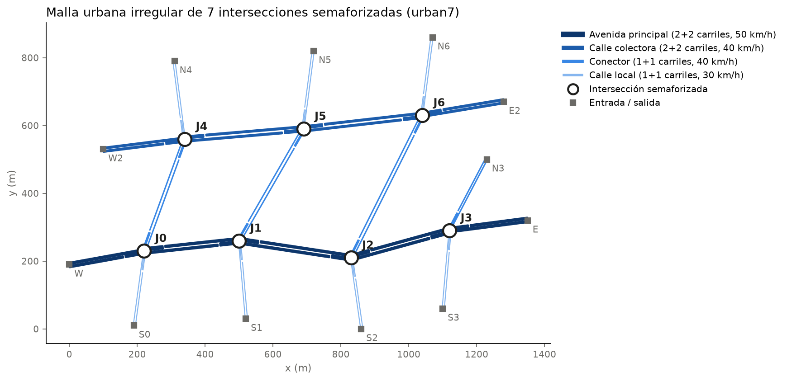

# World Models (LSTM · TSMixer · Transformer) para control de semáforos en SUMO

Implementación del proyecto descrito en `Articulo_WorldModels_LSTM_TSMixer_Transformer_SUMO_1.docx.md`.
El plan por etapas y los criterios de salida están en [`PLAN_DE_TRABAJO.md`](PLAN_DE_TRABAJO.md).

## Instalación (Python 3.11)

```bash
# Windows
py -3.11 -m venv .venv
.venv\Scripts\python -m pip install -r requirements.txt
# macOS / Linux
python3.11 -m venv .venv && .venv/bin/pip install -r requirements.txt

python check_env.py      # Etapa 0: debe terminar con "Entorno listo."
```

SUMO se instala desde pip (`eclipse-sumo`); `wm/utils.py` encuentra los binarios automáticamente
aunque `SUMO_HOME` no esté definida. En macOS hace falta `brew install gettext`.

## Estado de las etapas

| Etapa | Descripción | Estado |
|---|---|---|
| 0 | Entorno y esqueleto | ✅ |
| 1 | Escenario SUMO de 7 intersecciones | ✅ |
| 2 | `TrafficEnvironment` y `CustomStateBuilder` | ✅ |
| 3 | Dataset base (`base_v2`) | ✅ |
| 4 | Baselines | ✅ |
| 5 | Experimento 0 (AE/VAE) | ✅ (decisión: estado crudo) |
| 6 | Modelos temporales (LSTM, TSMixer, Transformer) | ✅ |
| 7 | Dream Environment + PPO | ✅ (3 modelos × 5 semillas) |
| 8 | PPO directo en SUMO | — |
| 9 | Evaluación final | — |
| 10 | Análisis y redacción | — |

## Etapa 1 — escenario `urban7` (malla urbana irregular)

```bash
python -m wm.env.scenario_builder        # regenera sumo/ desde configs/scenario.yaml
python scripts/validate_scenario.py      # 5 corridas por demanda: determinismo, teletransportes y colisiones
```

- 7 intersecciones semaforizadas de 4 brazos en una malla irregular (no un corredor recto):
  una **avenida principal** que zigzaguea (J0–J1–J2–J3, 2+2 carriles, 50 km/h), una **calle colectora** al norte,
  no paralela a la avenida (J4–J5–J6, 2+2 carriles, 40 km/h), **conectores diagonales** entre ambas
  (J0–J4, J1–J5, J2–J6, 1+1 carril) y **calles locales** de distinto largo y ángulo (1+1 carril, 30 km/h).
  12 entradas/salidas. Cada acceso tiene un bolsillo de 60 m con carril exclusivo de giro a la izquierda.
- Los movimientos se derivan de la geometría: en cada cruce los brazos se emparejan en dos ejes de brazos opuestos
  ("EO" = el más horizontal) y de ahí salen recto/izquierda/derecha para conexiones, fases y rutas.
- 4 fases verdes (NS recto+der., NS izq., EO recto+der., EO izq.) + amarillo 3 s + todo rojo 1 s.
  Programas `fixed` (ciclo de 90 s, activo por defecto) y `actuated` (verde 10–60 s).
- Demanda Poisson por ruta (giros 70/15/15 en cada cruce), constante a trozos cada 300 s.

Validación con tiempo fijo y semilla 1 (5 corridas por demanda, salidas idénticas en todas):

| Demanda | Vehículos insertados | Teletransportes | Colisiones | Espera media (s) | Viaje medio (s) |
|---|---|---|---|---|---|
| D1 Baja | 2458 | 0 | 0 | 67.8 | 171.8 |
| D2 Media | 4719 | 0 | 0 | 77.2 | 186.3 |
| D3 Alta | 6782 (de 7129 cargados) | 0 | 0 | 162.2 | 290.1 |
| D4 Pico | 4960 | 0 | 0 | 118.5 | 235.9 |
| D5 OOD | 5577 | 0 | 0 | 91.8 | 204.8 |

D3 queda cerca de saturación con tiempo fijo (347 vehículos no alcanzan a entrar): es el escenario donde un
controlador adaptativo tiene más margen de mejora.



## Etapa 2 — `TrafficEnvironment` y `CustomStateBuilder`

```bash
python -m pytest                    # pruebas unitarias (episodios cortos)
python scripts/validate_env.py      # episodio completo (720 pasos) con acciones aleatorias en D1..D5
```

- `wm/env/traffic_env.py`: entorno gymnasium, Δt = 5 s, 720 pasos, `MultiDiscrete([2]*7)`, libsumo (o TraCI).
  Modos `agent` (acciones externas), `fixed` y `actuated` (controla SUMO y el entorno solo observa).
  `info["action"]` es la acción **efectiva** (1 si empezó un cambio de fase en el paso), la que se guarda en el dataset.
- `wm/env/state_builder.py`: estado `7×13` (vehículos, detenidos, cola, velocidad, ocupación, espera acumulada,
  flujo de salida, fase one-hot, tiempo en fase, amarillo). Recompensa `r_t^i = −(W_{t+1}^i − W_t^i)/100`.
- Estadísticas por variable del episodio de validación: `results/stage2_env_check.csv`.

## Etapa 3 — dataset base congelado (`base_v2`)

```bash
python -m wm.data.build_base              # construye data/<versión de configs/dataset.yaml> (exige árbol git limpio)
python scripts/validate_dataset.py        # criterio de salida: checksums, fugas, solo lectura, ficha técnica
```

```python
from wm.data.base import load_base        # ÚNICO punto de acceso a los datos
ds = load_base("base_v2", "train", W=12, H=1)
item = ds[0]         # x [12, 98], delta [91], reward [7]  (normalizados)
X, dS, R = ds.arrays()
```

- 104 episodios: 4 demandas × 4 políticas × 6 semillas (train 1–4, val 5, test 6) + 8 de test-OOD (D5, semillas 7–8).
- Políticas (`wm/control/policies.py`): P1 tiempo fijo, P2 aleatoria restringida (p = 0,2 / 0,5 según la paridad de la semilla),
  P3 actuada de SUMO, P4 Max-Pressure cíclico con ε = 0,1.
- Se guarda la acción **efectiva**; normalización z-score por (intersección, variable) ajustada solo con train.
- Construcción atómica (directorio temporal → renombrar), `MANIFEST.sha256`, archivos de solo lectura y
  `config_used.yaml` con el commit y las versiones de software. Un dataset existente nunca se sobrescribe.
- La ficha técnica con estadísticas está en `data/base_v2/README.md`; el historial de versiones en `data/DATASETS.md`.
- Resultados de las políticas en `base_v2` (espera acumulada media por intersección): actuada 705 s,
  Max-Pressure 1706 s, tiempo fijo 2893 s, aleatoria 6702 s. 69 120 transiciones en train/val/test + 5760 en OOD.
- Los episodios `.npz` no van a git (se regeneran con el comando de arriba); los metadatos y el manifiesto sí.

## Etapas 4–10 — pipeline de experimentos

```bash
python scripts/run_pipeline.py --from 4     # Etapas 4-10 en secuencia (--from N / --to N), un log por etapa en runs/logs/
```

- Paralelismo de todas las etapas en `configs/compute.yaml` (`workers`); se lee al empezar cada etapa.
- **Todo es reanudable.** Si el proceso se interrumpe (p. ej. el equipo se suspende), basta con relanzar el mismo
  comando: los entrenamientos del modelo temporal continúan desde la última época terminada
  (`train_state.pt`, idéntico a no interrumpir), PPO desde el último punto de control (cada 4 actualizaciones) y
  la evaluación en SUMO desde el último episodio guardado. Un trabajo se reutiliza solo si su configuración no
  cambió (`job_key`).
- **Corrida de humo** (minutos, sin tocar `runs/` ni `results/`): copiar `configs/` a otra carpeta, reducir los
  presupuestos (épocas, pasos de PPO, escenarios) y redirigir las salidas:

  ```powershell
  $env:WM_CONFIGS="<tmp>\configs"; $env:WM_RUNS_DIR="<tmp>\runs"; $env:WM_RESULTS_DIR="<tmp>\results"
  .venv\Scripts\python scripts\run_pipeline.py --from 6
  ```

Baselines con λ = 1 (antes del cambio de pérdida; se recalculan con λ = 7/91 — ver `results/archive/lambda1/`):

| Modelo | RMSE 1 paso | RMSE 20 pasos |
|---|---|---|
| Persistencia | 0,477 | 0,740 |
| Media móvil | 0,561 | 0,605 |
| Ridge | 0,245 | 0,442 |
| MLP | 0,286 | 0,721 |

- Etapa 5 (Experimento 0): AE/VAE (z = 16, 32) no mejoran de forma significativa al estado crudo a h = 20
  (Wilcoxon + Holm), así que los modelos temporales trabajan sobre el estado crudo normalizado
  (`results/stage5_decision.json`).
- Etapa 6: LSTM, TSMixer y Transformer (~150 k parámetros cada uno) con el mismo protocolo: 12 configuraciones
  de búsqueda y 5 semillas finales por modelo (`wm/models/temporal.py`, `python -m wm.experiments.stage6_temporal`).
  Resultados por modelo en `results/stage6/<modelo>/` y comparación en `results/stage6_comparison.csv`.
  Test (media ± desv., 5 semillas; RMSE del estado normalizado), frente a Ridge 0,245 / 0,442 y MLP 0,203 / 0,374:

  | Modelo | Parámetros | RMSE 1 paso | RMSE 20 pasos |
  |---|---|---|---|
  | LSTM | 150 944 | 0,204 ± 0,002 | 0,335 ± 0,003 |
  | TSMixer | 150 251 | 0,205 ± 0,003 | 0,336 ± 0,006 |
  | Transformer | 149 818 | 0,208 ± 0,004 | 0,375 ± 0,008 |

  Los tres superan a persistencia y Ridge (Wilcoxon + Holm). LSTM y TSMixer no difieren de forma significativa;
  ambos superan al Transformer a 20 pasos (p_Holm < 0,001, δ de Cliff ≈ −0,45).
  Diagnóstico de la comparación TSMixer–Ridge (200 épocas y λ = 7/91 en la pérdida) en
  [`results/stage6_diagnostico.md`](results/stage6_diagnostico.md).
