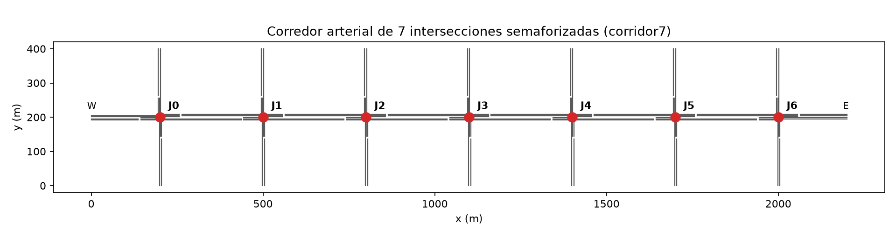

# World Models (LSTM · TSMixer · Transformer) para control de semáforos en SUMO

Implementación del proyecto descrito en `Articulo_WorldModels_LSTM_TSMixer_Transformer_SUMO_1.docx.md`.
El plan por etapas y los criterios de salida están en [`PLAN_DE_TRABAJO.md`](PLAN_DE_TRABAJO.md).

## Instalación (Python 3.11)

```bash
# Windows
py -3.11 -m venv .venv
.venv\Scripts\python -m pip install -r requirements.txt
# macOS / Linux
python3.11 -m venv .venv && .venv/bin/pip install -r requirements.txt

python check_env.py      # Etapa 0: debe terminar con "Entorno listo."
```

SUMO se instala desde pip (`eclipse-sumo`); `wm/utils.py` encuentra los binarios automáticamente
aunque `SUMO_HOME` no esté definida. En macOS hace falta `brew install gettext`.

## Estado de las etapas

| Etapa | Descripción | Estado |
|---|---|---|
| 0 | Entorno y esqueleto | ✅ |
| 1 | Escenario SUMO de 7 intersecciones | ✅ |
| 2 | `TrafficEnvironment` y `CustomStateBuilder` | ⏳ |
| 3 | Dataset `base_v1` | — |
| 4 | Baselines | — |
| 5 | Experimento 0 (AE/VAE) | — |
| 6 | Modelos temporales | — |
| 7 | Dream Environment + PPO | — |
| 8 | PPO directo en SUMO | — |
| 9 | Evaluación final | — |
| 10 | Análisis y redacción | — |

## Etapa 1 — escenario `corridor7`

```bash
python -m wm.env.scenario_builder        # regenera sumo/ desde configs/scenario.yaml
python scripts/validate_scenario.py      # 5 corridas por demanda: determinismo + teletransportes
```

- Corredor 1×7 (`J0…J6`), 300 m entre cruces, brazos de 200 m. Arteria de 2 carriles por sentido (50 km/h),
  transversales de 1 carril (40 km/h). Cada acceso tiene un bolsillo de 60 m con carril exclusivo de giro a la izquierda.
- 4 fases verdes (NS recto+der., NS izq., EO recto+der., EO izq.) + amarillo 3 s + todo rojo 1 s.
  Programas `fixed` (ciclo de 90 s, activo por defecto) y `actuated` (verde 10–60 s) en `corridor7.tls.add.xml`.
- Demanda Poisson por ruta (giros 70/15/15 en cada cruce), constante a trozos cada 300 s.

Validación con tiempo fijo y semilla 1 (5 corridas por demanda, salidas idénticas en todas):

| Demanda | Vehículos insertados | Teletransportes | Espera media (s) | Viaje medio (s) |
|---|---|---|---|---|
| D1 Baja | 3167 | 0 | 49.2 | 117.4 |
| D2 Media | 6031 | 0 | 53.6 | 122.7 |
| D3 Alta | 8897 | 0 | 95.5 | 173.9 |
| D4 Pico | 6262 | 0 | 70.0 | 142.6 |
| D5 OOD | 7152 | 0 | 58.9 | 129.8 |


